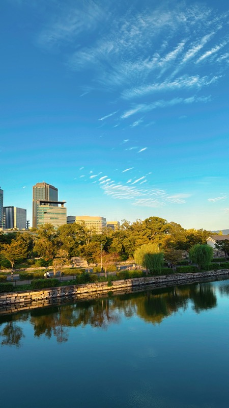
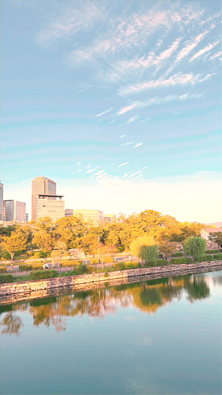

# ISP Pipeline

A simple Image Signal Processor (ISP) pipeline simulator written in Modern C++ (C++20).

## Overview

This project simulates the core image processing steps that happen inside a camera's ISP, converting RAW sensor data into a viewable RGB image.

## Pipeline
```
RAW → BLC → Demosaic → AWB → Gamma → Denoise → Sharpen → RGB Output
```

## Modules

| Module | Description | Algorithm |
|--------|-------------|-----------|
| **BLC** | Black Level Correction | Subtract black level offset from raw data |
| **Demosaic** | Bayer to RGB conversion | Bilinear interpolation |
| **AWB** | Auto White Balance | Gray World algorithm |
| **Gamma** | Gamma correction | LUT-based, γ=2.2 |
| **Denoise** | Noise reduction | Bilateral Filter |
| **Sharpen** | Edge enhancement | 3x3 convolution kernel |

## Results

| Input | Output (After ISP) |
|-------|-------------------|
|  |  |

## Performance Benchmark

Test image: 1206 x 2144 (2.5 MP)  
Platform: MacBook Air M4 (10 cores)

### Before Optimization (Single-threaded, without Denoise)

| Module | Time | Percentage |
|--------|------|------------|
| BLC | 32 ms | 3% |
| Demosaic | 466 ms | 50% |
| AWB | 75 ms | 8% |
| Gamma | 27 ms | 3% |
| Sharpen | 332 ms | 36% |
| **Total** | **932 ms** | 100% |

### After Optimization (OpenMP Multi-threading)

| Module | Time | Speedup |
|--------|------|---------|
| BLC | 16 ms | 2x |
| Demosaic | 99 ms | **4.7x** |
| AWB | 80 ms | - |
| Gamma | 27 ms | - |
| Denoise | 1968 ms | - |
| Sharpen | 68 ms | **5x** |
| **Total** | **2261 ms** | - |

*Note: Total time increased due to adding Denoise module (1968 ms). Without Denoise, the optimized pipeline runs in ~290 ms (3.2x faster than original 932 ms).*

### GPU Acceleration (CUDA)

| Platform | Denoise Time | Speedup |
|----------|--------------|---------|
| CPU (single-threaded) | ~20,000 ms | 1x |
| GPU (Tesla T4) | ~10 ms | **1930x** |

See [cuda/](cuda/) for the CUDA implementation.

## Memory Usage

Test image: 1206 x 2144 (2.5 MP)

| Data | Calculation | Size |
|------|-------------|------|
| RAW Image | 1206 × 2144 × 2 bytes | 5.2 MB |
| RGB Image | 1206 × 2144 × 6 bytes | 15.5 MB |
| Sharpen Copy | 1206 × 2144 × 6 bytes | 15.5 MB |
| Gamma LUT | 4096 × 2 bytes | 8 KB |
| **Peak Total** | | **~36 MB** |

### Optimization Opportunity

Sharpen currently copies the entire image. This can be optimized to keep only 3 rows (prev, curr, next), reducing memory from 15.5 MB to ~22 KB.

### Analysis

- **Demosaic** and **Sharpen** benefit most from parallelization (4.7x and 5x speedup)
- Both modules process each pixel independently, making them ideal for parallel execution
- **Gamma** is fast due to LUT optimization
- Overall pipeline achieves **3.2x speedup** with OpenMP

## Project Structure
```
ISP_Pipeline/
├── CMakeLists.txt
├── README.md
├── cuda/
│   ├── bilateral_cuda.cu  # CUDA implementation
│   └── README.md
├── include/
│   ├── image.hpp          # RAW image container
│   ├── rgb_image.hpp      # RGB image container
│   ├── io.hpp             # File I/O (RAW, PNG, PPM)
│   └── modules/
│       ├── blc.hpp
│       ├── demosaic.hpp
│       ├── awb.hpp
│       ├── gamma.hpp
│       ├── denoise.hpp
│       └── sharpen.hpp
├── src/
│   ├── main.cpp
│   ├── image.cpp
│   ├── rgb_image.cpp
│   ├── io.cpp
│   └── modules/
│       ├── blc.cpp
│       ├── demosaic.cpp   # OpenMP parallelized
│       ├── awb.cpp
│       ├── gamma.cpp
│       ├── denoise.cpp    # OpenMP parallelized, Bilateral Filter
│       └── sharpen.cpp    # OpenMP parallelized
├── tools/
│   └── generate_test_raw.cpp
└── vendor/
    ├── stb_image.h
    └── stb_image_write.h
```

## Build

### Requirements
- C++20 compiler (GCC 10+, Clang 12+, MSVC 2019+)
- CMake 3.20+
- OpenMP (for multi-threading optimization)

### macOS
```bash
# Install OpenMP via Homebrew
brew install libomp
```

### Steps
```bash
git clone https://github.com/dust2080/ISP_Pipeline.git
cd ISP_Pipeline
mkdir build && cd build
cmake ..
make
```

## Usage

### Using test RAW file
```bash
./build/generate_test_raw    # Generate test RAW
./build/isp_main             # Run pipeline
```

### Using PNG input
```bash
./build/isp_main path/to/image.png
```

Output will be saved to `data/output.png`.

## Technical Details

### Why Bilinear Demosaic?
Bilinear interpolation is the simplest demosaicing algorithm. While more advanced algorithms (e.g., AHD, VNG) produce better edge quality, bilinear is sufficient to demonstrate the ISP concept and is easier to understand.

### Why Gray World AWB?
Gray World assumes the average color of a scene is neutral gray. It's simple and effective for most scenes. More sophisticated methods like illuminant estimation could be added for better accuracy.

### Why LUT for Gamma?
Computing `pow()` for every pixel is expensive. A Lookup Table (LUT) pre-computes all 4096 possible values (for 12-bit), reducing gamma correction to simple array lookups.

### Why Bilateral Filter for Denoise?
Bilateral Filter is an edge-preserving smoothing algorithm. Unlike Gaussian blur which blurs everything equally, Bilateral Filter considers both spatial distance and color similarity. Pixels with similar colors get higher weights, while pixels with different colors (likely edges) get lower weights. This preserves edges while reducing noise in flat areas.

## Future Improvements

- [ ] Support more Bayer patterns (BGGR, GRBG, GBRG)
- [x] ~~Add noise reduction module~~ ✅ Implemented (Bilateral Filter)
- [ ] Implement edge-directed demosaicing
- [ ] Support real RAW formats (DNG) via libraw
- [x] ~~Multi-threading with OpenMP~~ ✅ Implemented (3.2x speedup)
- [x] ~~GPU acceleration with CUDA~~ ✅ Implemented (1930x speedup)

## License

MIT License
